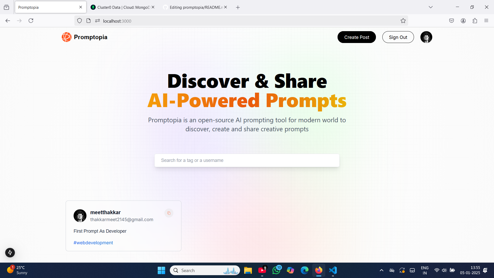
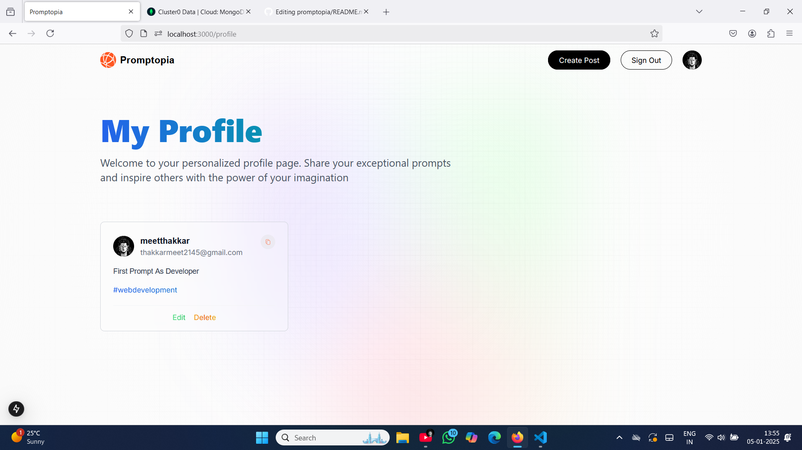
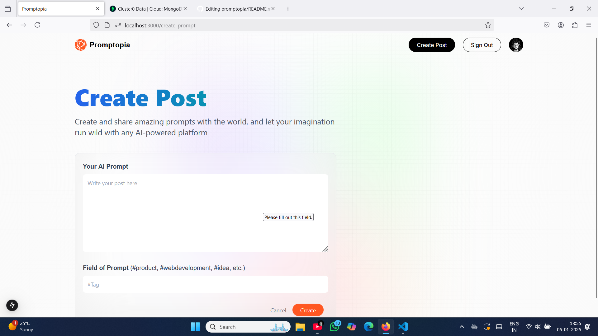

# Promptopia

Promptopia is a **Next.js-based web application** where users can authenticate using their Google account, write and share creative prompts, view other users' prompts, and manage their own prompts in a profile section. This project was created to explore and understand the basics of Next.js while building a functional and user-friendly application.

---

## Features

- **Google Authentication**: Seamless user login using Google OAuth.
- **Create Prompts**: Users can write and publish their creative prompts.
- **View Prompts**: Browse prompts written by other users.
- **Profile Management**:
  - Edit your prompts.
  - Delete prompts you no longer want to share.
- **Responsive Design**: Optimized for various screen sizes.

---

## Screenshots

### Homepage


### Profile Page


### create-prompt Page


---

## Getting Started

Follow these steps to run the project locally:

### Prerequisites

- [Node.js](https://nodejs.org/) installed on your system.
- MongoDB Atlas cluster set up and a connection URI.
- Google Cloud Console project for OAuth credentials.

### Installation

1. Clone the repository:
   ```bash
   git clone https://github.com/Meet-Thakkar21/promptopia.git
   ```

2. Navigate to the project directory:
   ```bash
   cd promptopia
   ```

3. Install dependencies:
   ```bash
   npm install
   # or
   yarn install
   ```

4. Create a `.env.local` file in the root directory and add the following:
   ```env
   GOOGLE_CLIENT_ID=your-google-client-id
   GOOGLE_CLIENT_SECRET=your-google-client-secret
   MONGODB_URI=your-mongodb-atlas-uri
   NEXTAUTH_URL=http://localhost:3000
   ```

5. Run the development server:
   ```bash
   npm run dev
   # or
   yarn dev
   ```

6. Open [http://localhost:3000](http://localhost:3000) in your browser to see the app in action.

---

## Project Structure

```plaintext
promptopia/
├── app/                 # Next.js app directory
│   ├── api/             # API routes for authentication and data handling
│   ├── profile/         # User profile section
│   └── page.js          # Home page
├── components/          # Reusable components
├── models/              # Mongoose models for MongoDB
├── utils/               # Utility functions
├── styles/              # CSS and global styles
├── .env.local           # Environment variables
└── README.md            # Project documentation
```

---

## Technologies Used

- **Frontend**: Next.js, React.js
- **Backend**: Node.js, Express
- **Database**: MongoDB Atlas
- **Authentication**: NextAuth.js with Google OAuth
- **Styling**: Tailwind CSS

---

## Learnings

This project helped in understanding:

- The **app directory structure** in Next.js.
- How to integrate **NextAuth.js** for authentication.
- Connecting a Next.js app with **MongoDB Atlas**.
- CRUD operations using **Mongoose**.

---

## Future Enhancements

- Add search and filtering functionality for prompts.
- Allow users to like or comment on prompts.
- Enhance UI with animations and better styling.
- Implement dark mode support.

---

---

## Contributing

Contributions are welcome! If you’d like to improve this project:

1. Fork the repository.
2. Create a new branch:
   ```bash
   git checkout -b feature-name
   ```
3. Make your changes and commit them:
   ```bash
   git commit -m "Add feature-name"
   ```
4. Push to your branch:
   ```bash
   git push origin feature-name
   ```
5. Open a pull request.

---


---

## Acknowledgements

- [Next.js Documentation](https://nextjs.org/docs)
- [MongoDB Atlas](https://www.mongodb.com/cloud/atlas)
- [NextAuth.js Documentation](https://next-auth.js.org/)

---

Feel free to reach out with any questions or suggestions! 😊
